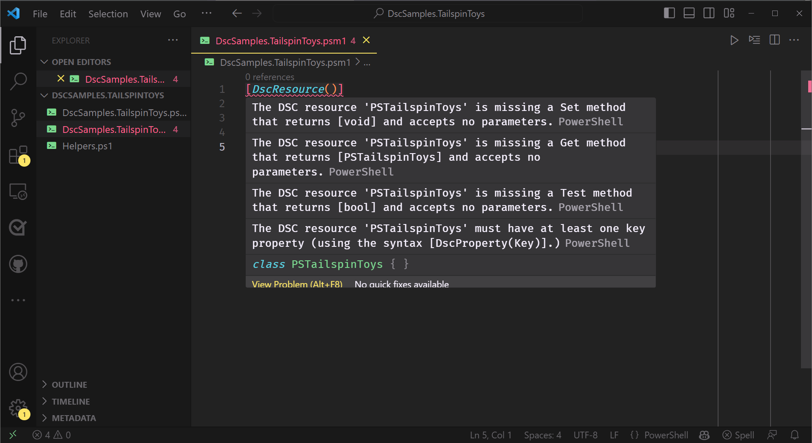

To define a class-based DSC Resource, we write a PowerShell class in a module file and add the
**DscResource** attribute to it.

## Define the class

In `DscSamples.TailspinToys.psm1`, add the following code:

```powershell
[DscResource()]
class PSTailspinToys {

}
```

This code adds `PSTailspinToys` as a class-based DSC Resource to the **DscSamples.TailspinToys**
module.

Hover on `[DscResource()]` and read the warnings.



<!--
    The commented snippet below should be added in a visually hidden block that is attached to the
    image with the `aria-describedby` attribute.
-->
<!--
Hovering on the DSC Resource attribute displays four warnings.

1. The DSC Resource 'PSTailspinToys' is missing a `Set()` method that returns `[void]` and accepts
   no parameters.
1. The DSC Resource 'PSTailspinToys' is missing a `Get()` method that returns `[PSTailspinToys]`
   and accepts no parameters.
1. The DSC Resource 'PSTailspinToys' is missing a `Test()` method that returns `[bool]` and accepts
   no parameters.
1. The DSC Resource 'PSTailspinToys' must have at least one key property (using the syntax
   `[DscProperty(Key)]`.)
-->

These warnings list the requirements for the class to be valid resource.

## Minimally implement required methods

Add a minimal implementation of the `Get()`, `Test()`, and `Set()` methods to the class.

```powershell
class Tailspin {
    [Tailspin] Get() {
        $CurrentState = [Tailspin]::new()
        return $CurrentState
    }

    [bool] Test() {
        return $true
    }

    [void] Set() {}
}
```

With the methods added, the **DscResource** attribute only warns about the class not having a
**Key** property.
